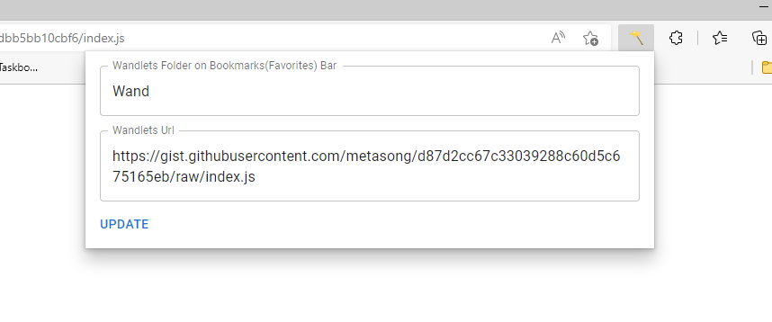
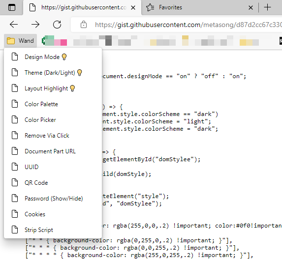

## Goal
with time going I create a bunch of javascript bookmarklets, they are convenient for me, but hard to maintain: to modify a bookmark let, I have to the js string out from bookmark manager's url, some time the space and other chars are encoded into 20%, 22%..., I have to modify and beautify the bookmarklet script, and then edit. This is not the editing experience I want. Further more, it's easy to lost all your bookmarklets, when you forgot backup, and the default bookmark manager could not just backup just a specific folder, it would backup all your bookmarks. And it's also hard to sync your bookmark between different browsers.

So I created a bookmarklet manager named magicWand. It can import your bookmarklets from a remote git javascript file.
the default gist javascript file is: 
https://gist.githubusercontent.com/metasong/d87d2cc67c33039288c60d5c675165eb/raw/b4f2c360802a181fbf7e816c52d3dbb5bb10cbf6/index.js

you could fork from it and create your own.

